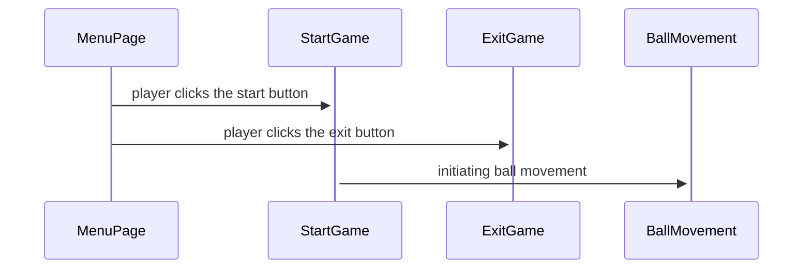
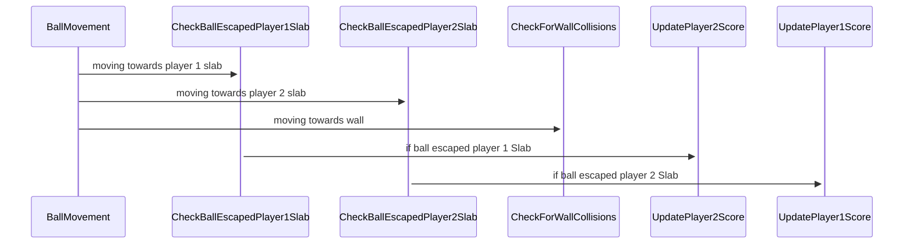
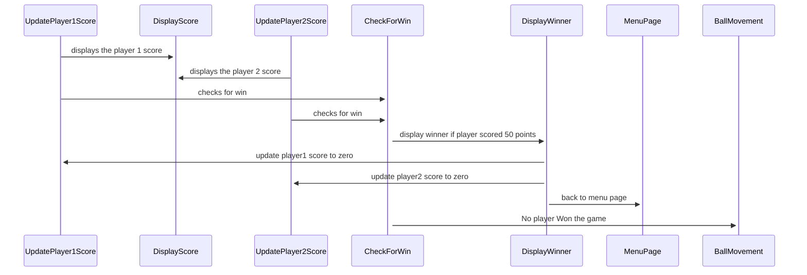
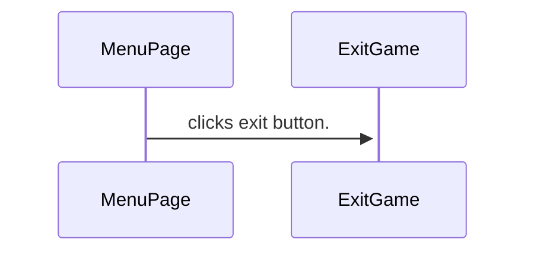

# Interaction Sequences

## Startup Sequence

```mermaid
sequenceDiagram
  MenuPage->>+StartGame:player clicks the start button
  MenuPage->>+ExitGame:player clicks the exit button
  StartGame->>+BallMovement:initiating ball movement
```

## Movement Initiation

```mermaid
sequenceDiagram
  BallMovement->>+CheckBallEscapedPlayer1Slab:moving towards player 1 slab
  BallMovement->>+CheckBallEscapedPlayer2Slab:moving towards player 2 slab
  BallMovement->>+CheckForWallCollisions:moving towards wall
  CheckBallEscapedPlayer1Slab->>+UpdatePlayer2Score:if ball escaped player 1 Slab
  CheckBallEscapedPlayer2Slab->>+UpdatePlayer1Score:if ball escaped player 2 Slab
```

## Points updation and Winner Declaration

```mermaid
sequenceDiagram
  UpdatePlayer1Score->>+DisplayScore:displays the player 1 score
  UpdatePlayer2Score->>+DisplayScore:displays the player 2 score
  UpdatePlayer1Score->>+CheckForWin:checks for win
  UpdatePlayer2Score->>+CheckForWin:checks for win
  CheckForWin->>+DisplayWinner:display winner if player scored 50 points
  DisplayWinner->>+UpdatePlayer1Score:update player1 score to zero
  DisplayWinner->>+UpdatePlayer2Score:update player2 score to zero
  DisplayWinner->>+MenuPage:back to menu page
  CheckForWin->>+BallMovement:No player Won the game
```

## Exit Game

```mermaid
sequenceDiagram
  MenuPage->>+ExitGame:clicks exit button.
```
