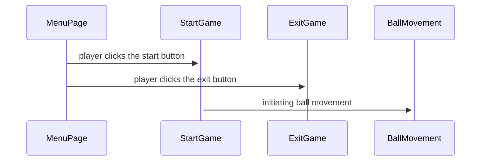
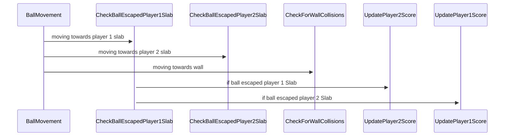

# Interaction Sequences

## Startup Sequence

```mermaid
sequenceDiagram
  MenuPage->>+StartGame:player clicks the start button
  MenuPage->>+ExitGame:player clicks the exit button
  StartGame->>+BallMovement:initiating ball movement
```

## Movement Initiation

```mermaid
sequenceDiagram
  BallMovement->>+CheckBallEscapedPlayer1Slab:moving towards player 1 slab
  BallMovement->>+CheckBallEscapedPlayer2Slab:moving towards player 2 slab
  BallMovement->>+CheckForWallCollisions:moving towards wall
  CheckBallEscapedPlayer1Slab->>+UpdatePlayer2Score:if ball escaped player 1 Slab
  CheckBallEscapedPlayer1Slab->>+UpdatePlayer1Score:if ball escaped player 2 Slab
```

## One score

-describe-how-the-modules-interact-to-record-scores
